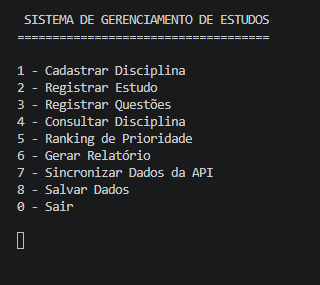
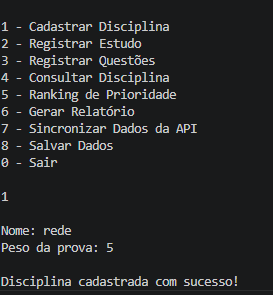
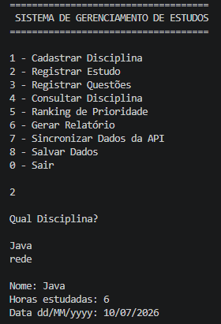
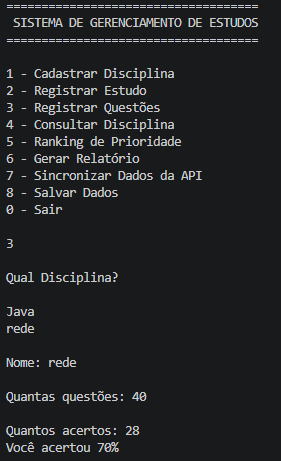
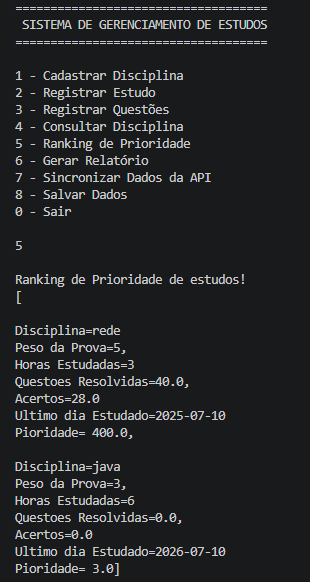
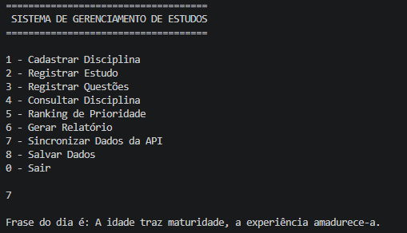
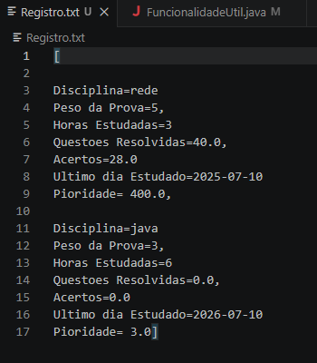

# Sistema de Gerenciamento de Estudos

Projeto desenvolvido em Java como desafio técnico para consolidar conhecimentos em Programação Orientada a Objetos.

## Funcionalidades

- Cadastro de disciplinas
- Registro de horas estudadas
- Registro de questões resolvidas
- Ranking de prioridade
- Consulta de disciplinas
- Geração de relatórios
- Consumo de API pública
- Persistência de dados

## Tecnologias

- Java 21
- Collections
- Stream API
- Regex
- LocalDate
- HttpClient
- Manipulação de arquivos

## Estrutura

```
src
├── model
├── repository
├── service
├── util
└── Main.java
```

## Como executar

1. Clone o projeto

```bash
git clone URL_DO_REPOSITORIO
```

2. Execute a classe Main.

## Objetivo

Este projeto foi desenvolvido como prática para demonstrar conhecimentos em Java e servir como portfólio para vagas de Desenvolvedor Java Júnior.

## Menu Principal



## Cadastro



## Registro de Estudos



## Registro de Questôes



## Consulta


## Ranking



## Sincronizar da Api



## Salvar Dados



